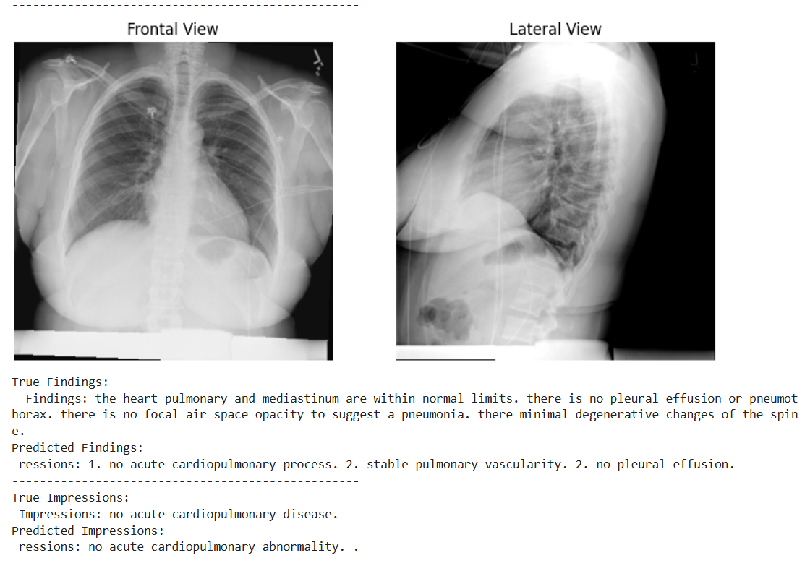
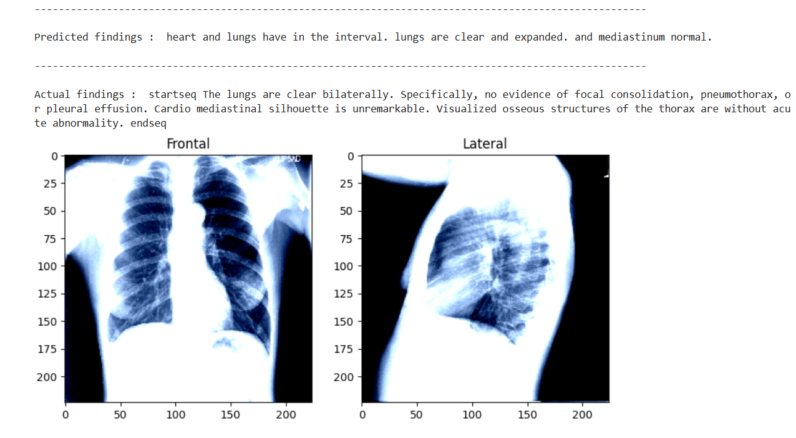
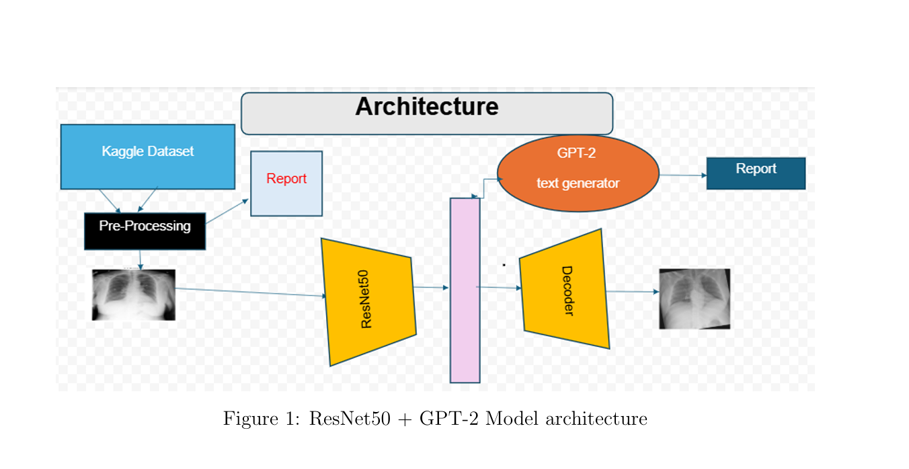
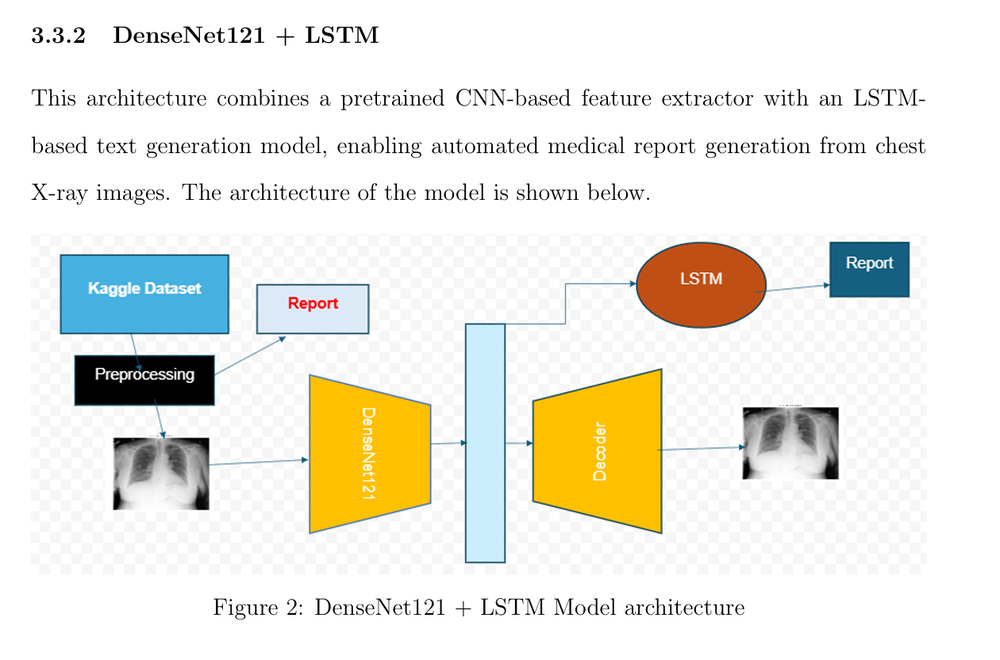

# 🏥 Automatic Medical Report Generation

This project explores deep learning methods for generating medical reports from chest X-ray images using the **Indiana University Chest X-ray dataset**.

The goal is to compare vision-language and encoder-decoder architectures for automatic radiology report generation.

## 🧠 Architectures Implemented

1. **ResNet50 Encoder + GPT-2 Decoder** — PyTorch  
2. **DenseNet121 Encoder + LSTM Decoder** — TensorFlow  

Both models are trained and evaluated, with generated report samples included in the notebooks.

## 📁 Project Structure

```text
medical-report-generation/
│
├── images/
│   ├── evaluation-measure-comparison.png
│   ├── model-architecture-GPT-2.png
│   ├── model_architecture_LSTM.png
│   ├── output-gpt2.png
│   └── output-lstm.png
│
├── notebooks/
│   ├── 01_resnet50_gpt2.ipynb      # PyTorch: ResNet50 + GPT-2
│   └── 02_densenet121_lstm.ipynb   # TensorFlow: DenseNet121 + LSTM
│
├── .gitignore
└── README.md
```

## 📊 Model Evaluation

Each notebook includes:

- BLEU scores
- ROUGE metrics
- Generated medical report samples
- Visual and qualitative comparison of both architectures

## 📦 Dataset

**Dataset:** Chest X-rays — Indiana University  
**Source:** Kaggle — Indiana University Chest X-ray dataset

The dataset is not included in this repository. Download it from Kaggle and update the dataset path inside the notebooks if needed.

## 🛠️ How to Run

### 1. Clone the repository

```bash
git clone https://github.com/yaekobB/medical-report-generation.git
cd medical-report-generation
```

### 2. Install dependencies

```bash
pip install torch tensorflow transformers matplotlib numpy pandas scikit-learn pillow nltk rouge-score
```

### 3. Open the notebooks

You can run the notebooks using:

- Jupyter Notebook
- Google Colab
- VS Code with Python/Jupyter support

## 📷 Example Outputs

### ResNet50 + GPT-2 Output



### DenseNet121 + LSTM Output



### Model Architectures

#### ResNet50 + GPT-2 Architecture



#### DenseNet121 + LSTM Architecture



### Evaluation Comparison


## ⚠️ Medical Disclaimer

This project is for educational and research purposes only. It is not intended for clinical diagnosis, treatment decisions, or real-world medical deployment.

## 🚀 Future Improvements

- Fine-tune larger vision-language models.
- Improve report quality using domain-specific medical language models.
- Add clinical explainability methods.
- Evaluate generated reports with additional medical NLP metrics.
- Deploy a simple demo interface for inference.

## 📄 License

This project is open-source under the MIT License.

## 👤 Author

**Yaekob Beyene Yowhanns**  
M.Sc. Artificial Intelligence and Computer Science  
University of Calabria
